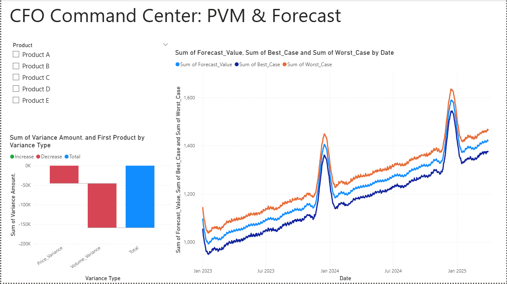

# 📊 The Intelligent FP&A Command Center
### *Automating Price-Volume-Mix Analysis & AI Forecasting*

> *The Executive Dashboard: Integrating historical PVM variance analysis with forward-looking AI predictions.*

---

## 💼 Business Problem
Strategic finance teams often struggle with two key challenges:
1.  **Static Variance Analysis:** Traditional Excel models for Price-Volume-Mix (PVM) are manual, error-prone, and slow when handling SKU-level data.
2.  **Reactive Forecasting:** Revenue predictions are often simple "run rates" that fail to account for seasonality or complex trends.

**The Solution:** An automated "Hybrid" pipeline that bridges the gap between **Accounting Logic** and **Data Science**.

---

## 🛠️ The Tech Stack
* **Python (Google Colab):** Used for the heavy lifting (ETL & Machine Learning).
    * `Pandas`: For vectorizing PVM calculations across thousands of transactions.
    * `Facebook Prophet`: For generating Machine Learning time-series forecasts with confidence intervals.
* **Power BI:** Used for the "CFO-Ready" presentation layer.
    * `DAX`: For measure calculation.
    * `Power Query`: For unpivoting variance data.

---

## 🔍 Key Modules

### 1. The PVM Engine (Variance Analysis)
Instead of standard Excel formulas, I utilized Python to calculate the three core drivers of revenue variance programmatically:
* **Price Effect:** $(Actual Price - Budget Price) \times Actual Volume$
* **Volume Effect:** $(Actual Volume - Budget Volume) \times Budget Price$
* **Mix Effect:** Analyzed via product-level granularity in the dashboard.

### 2. The AI Forecaster
I implemented the **Prophet** algorithm to predict Q1 revenue.
* **Why Prophet?** It handles seasonality (holiday dips) and trend shifts better than standard linear regression.
* **Output:** The model generates a 90-day forecast with "Best Case" and "Worst Case" scenarios (Confidence Intervals), allowing for risk-adjusted planning.

---

## 📈 How to Run This Project
1.  **View the Code:** Open `FPA_Analysis_Engine.ipynb` to see the Python logic for data generation and PVM calculation.
2.  **View the Dashboard:** The `dashboard_overview.png` showcases the final Power BI implementation.

---
*Author: [Your Name] | Specialized in Finance Transformation & Analytics*
